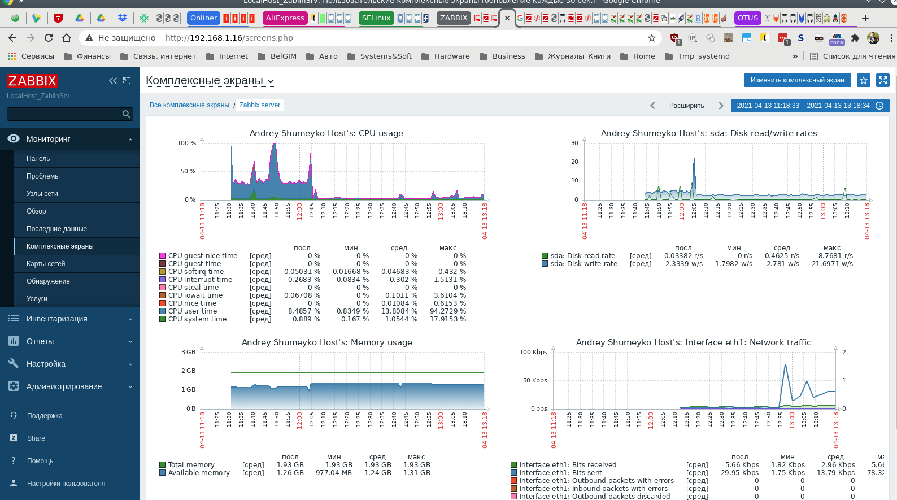
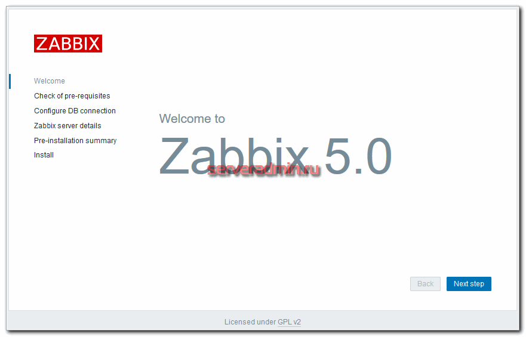

#       Мониторинг ZAbbix, Prometeus+graphana

#       1. ДЗ Мониторинг состояния системы

##        1.1  Установка и настройка zabbix:

1. Установка epel-release

      dnf install epel-release
      dnf install -y policycoreutils-python-utils setroubleshoot-server setools-console

___

2. Устанавливаем MariaDB. Подключаем репозиторий. Для этого создаем файл /etc/yum.repos.d/mariadb.repo следующего содержания:

      # MariaDB 10.5 CentOS repository list - created 2021-04-12 21:30 UTC
      # http://downloads.mariadb.org/mariadb/repositories/
      [mariadb]
      name = MariaDB
      baseurl = http://yum.mariadb.org/10.5/centos8-amd64
      module_hotfixes=1
      gpgkey=https://yum.mariadb.org/RPM-GPG-KEY-MariaDB
      gpgcheck=1

Устанавливаем MariaDB-server

            yum install MariaDB-server MariaDB-client &&

___

3. Устанавливаем zabbix

      dnf -y --nogpgcheck https://repo.zabbix.com/zabbix/5.2/rhel/8/x86_64/zabbix-release-5.2-1.el8.noarch.rpm

      dnf install zabbix-server-mysql zabbix-web-mysql zabbix-nginx-conf zabbix-agent

      Установим пакет glibc-langpack-ru, для подключения русского языка в интерыфейсе
      dnf install glibc-langpack-ru

Агент для linux систем ставится из того же репозитория:

- https://repo.zabbix.com/zabbix/5.2/rhel/8/x86_64/zabbix-release-5.2-1.el8.noarch.rpm

        dnf install -y --nogpgcheck zabbix-agent2.x86_64

___

4. Создадим теперь пользователя и базу данных mysql для zabbix

    mysql -uroot -p

      mysql> create database zabbix character set utf8 collate utf8_bin;
      mysql> create user 'zabbix'@'localhost' identified by 'zabuser....';
      mysql> grant all privileges on zabbix.* to zabbix@localhost;
      mysql> exit

___

5. Импортируем структуру базы данных для Zabbix 5 из файла. Пароль используем zabuser...., который указали ранее

      zcat /usr/share/doc/zabbix-server-mysql*/create.sql.gz | mysql -uzabbix -p zabbix

  - Настройка и небольшой тюнинг mariadb.  Для этого открываем конфиг mysql /etc/my.cnf.d/server.cnf и приводим его к следующему виду.

              /etc/my.cnf.d/server.cnf

        [client]
        port		= 3306
        socket		= /var/lib/mysql/mysql.sock
        default-character-set=utf8

        [mysqld]
        character_set_server=utf8
        collation-server=utf8_bin
        init_connect="SET NAMES utf8 collate utf8_bin"
        port = 3306
        socket = /var/lib/mysql/mysql.sock
        innodb_file_per_table=1 innodb_buffer_pool_size = 768M # внимание на параметр! установить примерно в 2 раза меньше объема оперативной памяти сервера
        innodb_buffer_pool_instances=1 # увеличивать на 1 каждый GB
        #innodb_buffer_pool_size
        innodb_flush_log_at_trx_commit = 0
        innodb_log_file_size = 512M
        innodb_log_files_in_group = 3
        innodb-strict-mode = OFF

___

Открываем конфиг сервера zabbix - /etc/zabbix/zabbix_server.conf и указываем там параметры подключения к mysql.

      vi /etc/zabbix/zabbix_server.conf

      DBHost=localhost
      DBName=zabbix
      DBUser=zabbix
      DBPassword=zabuser....
      Timeout=20

___

##      1.2 Настройка SELinux для zabbix server-a

Сразу отключить SELinux на zabbix процессе, но логировать ошибки:

    - semanage permissive -a zabbix_t <---- Разрешить процесс с типом zabbix_t, но логировать AVC сообщения

Но для того, чтобы настроить работу zabbix сервера с SELinux, скачаем один готовый модуль и пару создадим своих

       curl https://support.zabbix.com/secure/attachment/53320/zabbix_server_add.te > zabbix_server_add.te
       checkmodule -M -m -o zabbix_server_add.mod zabbix_server_add.te
       semodule_package -m zabbix_server_add.mod -o zabbix_server_add.pp
       semodule -i zabbix_server_add.pp

Теперь создаем свой модуль. Для того, чтобы это получилось, мы должно хотя бы один раз неудачно запустить zabbix server с включенным selinux.

      ausearch -c 'zabbix_server' --raw | audit2allow -M my-zabbixserver
      semodule -X 300 -i my-zabbixserver.pp

\#Модуль разрешения на подключение zabbix к mysql сокету /var/lib/mysql/mysql.sock
ausearch -c 'zabbix_server' --raw | audit2allow -M zabbixserver_mysql
semodule -X 300 -i zabbixserver_mysql.pp
___
\#Модуль разрешения на подключения php-fpm к zabbix к порту 10051
ausearch -c 'php-fpm' --raw | audit2allow -M my-phpfpm-10051
semodule -X 300 -i my-phpfpm-10051.pp
___

Запускаем zabbix server еще раз.

      systemctl start zabbix-server

___

Теперь подготовим web сервер. Для этого открываем конфиг nginx /etc/nginx/conf.d/zabbix.conf и устанавливаем там 2 параметра:

    vi /etc/nginx/conf.d/zabbix.conf

      listen          80 default_server;
      server_name     zablinrv

Указываем свое имя виртуального хоста (zablinrv) для zabbix сервера. Если хотим подключаться не только по доменному имени, но и по ip адресу к web интерфейсу zabbix, необходимо в помимо listen 80, добавить директиву default_server (listen          80 default_server).
Одновременно с этим удаляем эту же директиву в основном конфиге nginx - /etc/nginx/nginx.conf. Вместо:

    listen 80 default_server;

Сделать просто:

    listen          80

в завершении редактируем конфиг php-fpm - /etc/php-fpm.d/zabbix.conf, указывая свой часовой пояс.

      vi /etc/php-fpm.d/zabbix.conf

      php_value[date.timezone] = Europe/Minsk

Запускаем компоненты web сервера.

      systemctl enable --now nginx php-fpm

Теперь можно пройти в браузере по ip адресу  и откроется первая страница установщика Zabbix Server 5.
___

